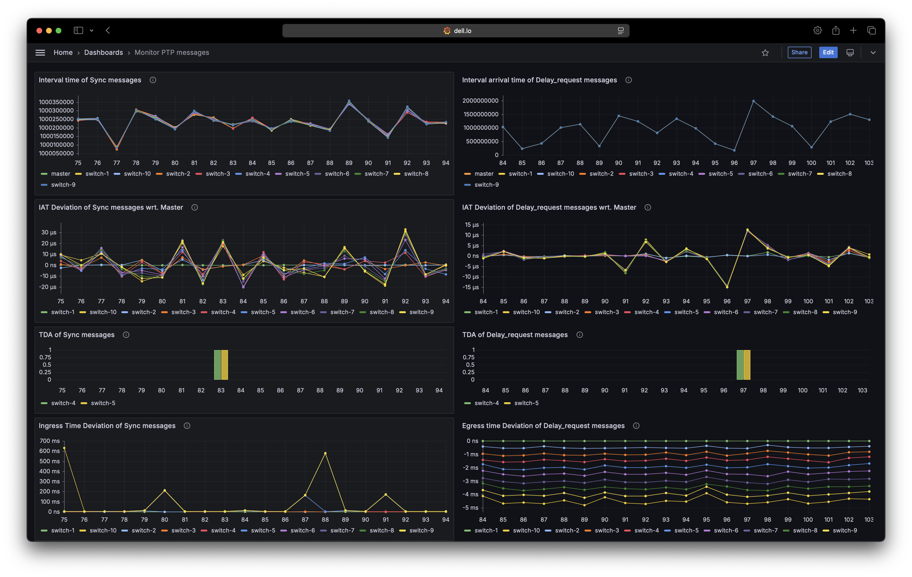
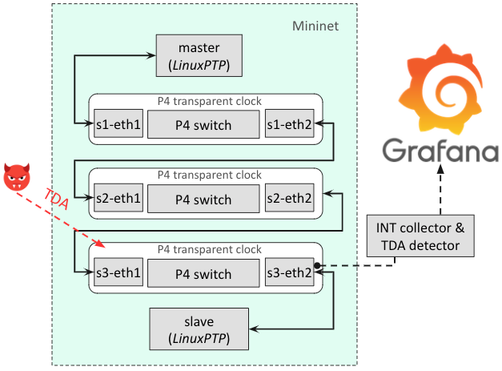
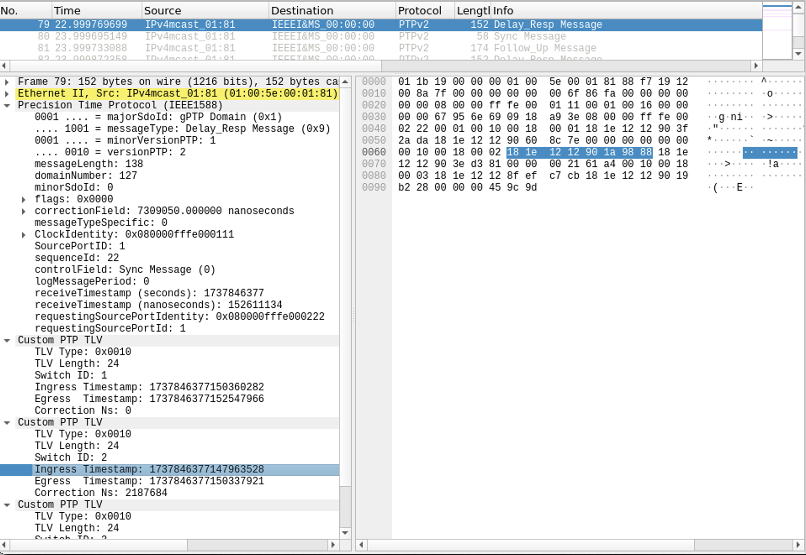

# 1. Introduction

This repository contains an emualtor of PTP time synchronization using Linuxptp. 

The network is emulated using Mininet. It consists of n P4 switches in which we setup n transparent clocks.
The network topology is as below:

```
PTP server (h1) -- s1 ----- s2 ----- ... --- sn -- (h2) PTP client
```

The transparent clocks are implemented using P4

# 2. Requirements

- mininet
- linuxptp
- P4 virtual switch BMv2

This setup has been tested under Ubuntu 22.04 (virtual machine using VirtualBox, or a physicall Dell laptop):

```
$ lsb_release -a
No LSB modules are available.
Distributor ID:	Ubuntu
Description:	Ubuntu 22.04.5 LTS
Release:	22.04
Codename:	jammy
$ uname -a
Linux mmt 5.15.0-124-generic #134-Ubuntu SMP Fri Sep 27 20:20:17 UTC 2024 x86_64 x86_64 x86_64 GNU/Linux
```


## Setup

### P4-related components 

In this step, we will install components supporting P4 program: a P4 compiler and a virtual switch BMv2

#### P4 compiler

The compiler is available [here](https://github.com/p4lang/p4c)

```bash
source /etc/lsb-release
echo "deb http://download.opensuse.org/repositories/home:/p4lang/xUbuntu_${DISTRIB_RELEASE}/ /" | sudo tee /etc/apt/sources.list.d/home:p4lang.list
curl -fsSL https://download.opensuse.org/repositories/home:p4lang/xUbuntu_${DISTRIB_RELEASE}/Release.key | gpg --dearmor | sudo tee /etc/apt/trusted.gpg.d/home_p4lang.gpg > /dev/null
sudo apt-get update
sudo apt install p4lang-p4c
```

#### BMv2

The virtual switch is available [here](https://github.com/p4lang/behavioral-model). As we need to patch this switch to get ingress and egress timestamps, then we need to install it from source code within our patch.

```bash
# install requirements
sudo apt-get install -y automake cmake libgmp-dev \
    libpcap-dev libboost-dev libboost-test-dev libboost-program-options-dev \
    libboost-system-dev libboost-filesystem-dev libboost-thread-dev \
    libevent-dev libtool flex bison pkg-config g++ libssl-dev
# clone source code
cd bmv2
git clone https://github.com/p4lang/behavioral-model.git

# apply our patch
cd behaviral-model
# the latest patch is available here: https://github.com/p4lang/behavioral-model/compare/main...montimage-projects:behavioral-model:main
git checkout 199af48 #moment I tested BMv2
git apply ../bmv2.patch
# install libraries
sudo bash ci/install-thrift.sh
sudo bash ci/install-nanomsg.sh
# compile and install
./autogen.sh && ./configure
make -j && sudo make install
```

### Mininet

For further information of Mininet, go [here](https://github.com/mininet/mininet)

```bash
sudo apt-get install mininet
```

### Python libraries

Our INT [collector](mininet/collector/collector.py) is implemented using Python and used `scapy` to sniff packets

```bash
python3 -m pip install -r ./mininet/requirements`
```

### Grafana (optional)

We use Grafana to graphically display results. For furter information of Grafana, go [here](https://grafana.com/docs/grafana/latest/setup-grafana/installation/debian/)

You can install Grafana or use it from Docker:

#### Use Grafana docker image:

```bash
docker run -d -p 3000:3000 --name=grafana grafana/grafana-enterprise
```

#### Install Grafana

```bash
# install the rerequisite packages
sudo apt-get install -y apt-transport-https software-properties-common wget
# import the GPG key
sudo mkdir -p /etc/apt/keyrings/
wget -q -O - https://apt.grafana.com/gpg.key | gpg --dearmor | sudo tee /etc/apt/keyrings/grafana.gpg > /dev/null
# add a repository for stable releases
echo "deb [signed-by=/etc/apt/keyrings/grafana.gpg] https://apt.grafana.com stable main" | sudo tee -a /etc/apt/sources.list.d/grafana.list
# install Grafana
sudo apt-get update
sudo apt-get install grafana-enterprise
# install Infinity plugin
grafana-cli plugins install yesoreyeram-infinity-datasource
sudo systemctl restart grafana-server
```

#### Setup Grafana dashboard

- Open http://localhost:3000 and login Grafana GUI using `admin/admin` as user/password
- Click `Menu`(top-left corner), navigate to `Dashboards` / `Import`, then import a json file at `mininet/collector/grafana.json`
- After importing, you should see a dashboard having 6 charts that will be as the following once having data to show:




### Install NetworkDelayEmulator to emulate TDA

We will install [Network delay emulator](https://github.com/DETERMINISTIC6G/NetworkDelayEmulator) that is used to emulate a time-delay attack.

#### Install the delay emulator

```bash
# we will put the tool at the home directory
cd
# install basic tools to build the kernel module 
sudo apt install bison flex build-essential python3 python3-numpy git
sudo apt install linux-headers-$(uname -r)
# get its source code
git clone https://github.com/DETERMINISTIC6G/NetworkDelayEmulator.git
# compile it
cd ~/NetworkDelayEmulator/sch_delay
make clean & make
# load the delay module into kernel
sudo insmod build/sch_delay.ko
# check whether the module has been loaded successfully
lsmod | grep sch_delay
#result: sch_delay              16384  0
```

#### Install tools to control the delay emulator

As the delay emulator will be loaded into kernel, we need tools to communicate with it: modified `tc` tool

```bash
# go into `tc` folder inside NetworkDelayEmulator
cd ~/NetworkDelayEmulator/tc
git clone --branch v6.5.0 https://github.com/iproute2/iproute2.git
# apply the patch
cp q_delay.c iproute2/tc
patch -R ./iproute2/tc/Makefile Makefile.patch
# compile the tool
cd iproute2
make
# new tc tool is available at 
ls -lrat ~/NetworkDelayEmulator/tc/iproute2/tc/tc
```

# 3. Execution

The following steps will create a virtual network using the topology defined in `topos/3-virtuals.json`. Specifically, the network consists of:

- 3 transparent clocks
- a PTP server
- a PTP client which run in free-mode in which the client does not modify the timestamp of the system.



## Start the emulator

```bash
cd mininet
sudo make all
```

## Start Collector

```bash
cd mininet
sudo python3 collector/collector.py --nic s3-eth2
```

## View Grafana dashboard

View monitoring results at Grafana dashboard

## Inject time-delay attacks

```bash
# load the delay qdisc
sudo ~/NetworkDelayEmulator/tc/iproute2/tc/tc qdisc add dev s3-eth1 root handle 1:0 delay reorder False limit 1000
# setup delay
sudo python3 ~/NetworkDelayEmulator/userspace_delay/userspace_delay.py /dev/sch_delay/s3-eth1-1_0
# Select Distribution: 2
# Please specify the desired delay in nanoseconds: 55555 
```

A video screencast of the demo is available [here](demo/ptp-monitoring.mp4)

<video src="https://github.com/DETERMINISTIC6G/ptp-in-mininet/raw/refs/heads/main/demo/ptp-monitoring.mp4" width="640px"></video>

# 4. Divers

## Wireshark dissector

To view in Wireshare the customized TLV extensions that are used by Inband Network Telemetry,
we develop a small dissector in Lua to be integrated into Wireshark.
To do so under Ubuntu, you need to copy this dissector file to ~/.local/lib/wireshark/plugins/ 

```bash
cp mininet/collector/wireshark-ptp-tlv-dissector.lua ~/.local/lib/wireshark/plugins/ 
```



## Use the PTP client on a raspberry Pi

You might need to separate the PTP client on another machine, such as a raspberry Pi, so that it can update the system time (not in free-running mode).
To do so, you need to:

- install LinuxPTP on that machine
- copy [mininet/configs/slave.cfg](mininet/configs/slave.cfg) to that machine, and remove this line `free_running 1` in the file
- run the client: `sudo timeout ptp4l -i enxb827ebcf092b -f /home/pi/configs/slave.cfg`, in which `enxb827ebcf092b` is a NIC that is used to connect to the machine running the emulator. See [this example](mininet/Makefile#L34C37-L34C128)
- start the emulator within a topology conf which differes than the virtual one, such that, [mininet/topos/10-switches.json](mininet/topos/10-switches.json): `make test-10-switches`. See [this example](mininet/Makefile#L53C1-L61). You might need to update `override_ports` to the NIC on which the emulator machine connects to the raspberry Pi.

## Dataset

Several datasets representing test results are available at [./mininet/test](./mininet/test)


<hr/>


 by [@nhnghia](https://github.com/nhnghia) 
